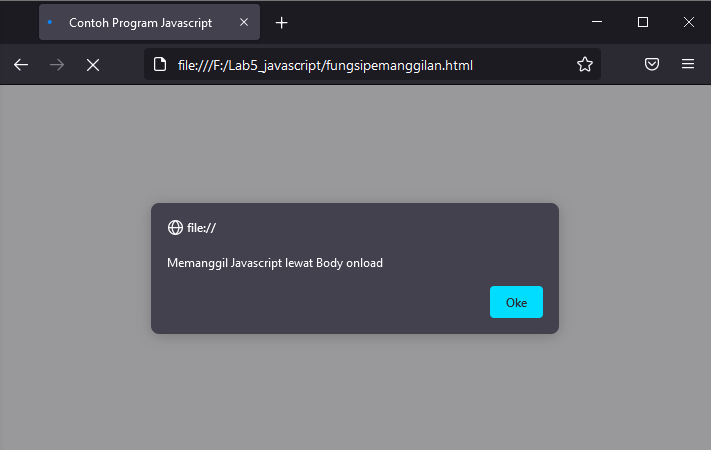

# Lab5_javascript.

Nama  : Miftahu Rizkiyah  
NIM   : 312010014  
Kelas : TI.20.B.1  
Tugas : Pemograman Web (Pertemuan ke-6 - Praktikum ke-5)  

-----------------------------------------

## **Pengenalan Javascript**

 

## **Javascript Dasar**

* Pemakaian Alert sebagai property window.  

 

* Pemakaian method dalam objek  

 

* Pemakaian Prompt  

 

* Pembuatan fungsi dan cara pemanggilannya  

 

## Dasar Pemrograman di Javascript

* Operasi dasar aritmatika 

 

* Seleksi kondisi (if..else)  
  

 

* Penggunaan operator switch untuk seleksi kondisi  
  

 

## Pembuatan Form

* Form Input  
